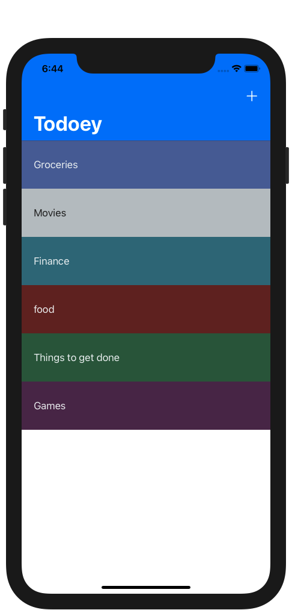
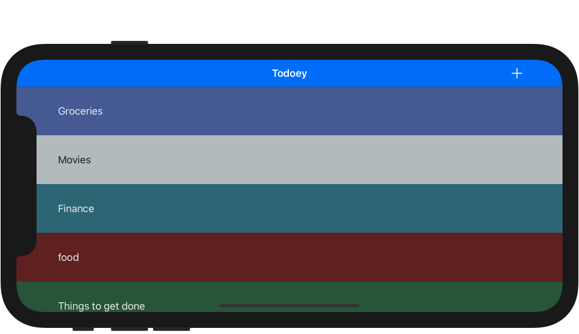
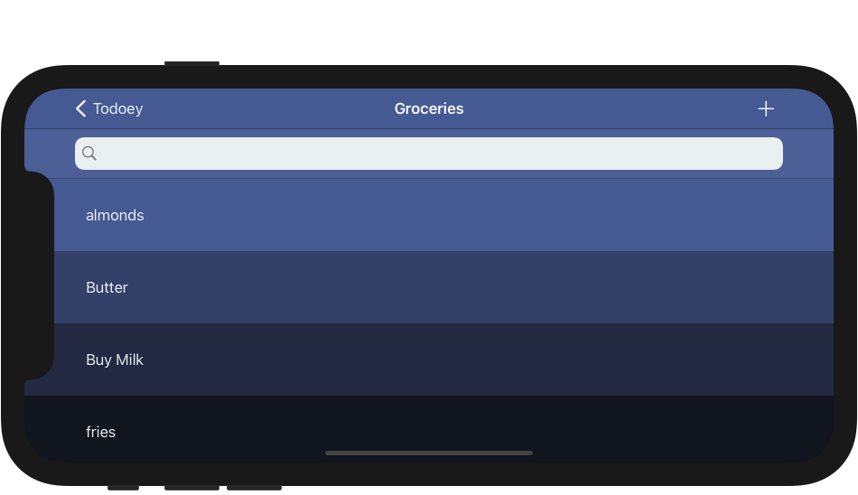
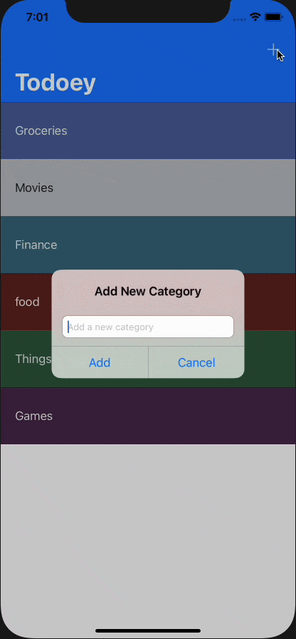

# Todoey
### Screen Shots

---

### Table of Contents

- [Description](#description)
- [How To Use](#how-to-use)
- [Author Info](#author-info)

## Description

- A TodoList App that uses Realm to store data locally.

---

### What I Learned:

- Learned how to first persist data using Core-Data
- Switched over to **Realm** as the local database
- Worked with various cocoapods such as **ChameleonFramework**, **Realm**, and **SwipeCellKit**
- Used Realm object to create links between objects
- Advanced my knowledge on working with TableViewControllers and manipulating cells
- Learned about search functionality by searching through the todoList app

---

## How To Use

- Clone the project and run it on Xcode
---

## Author Info
- Website - [LinkedIn: Gurpreet Singh](https://www.linkedin.com/in/gurpreet-singh-a2651b107/)

[Back To The Top](#Todoey)
